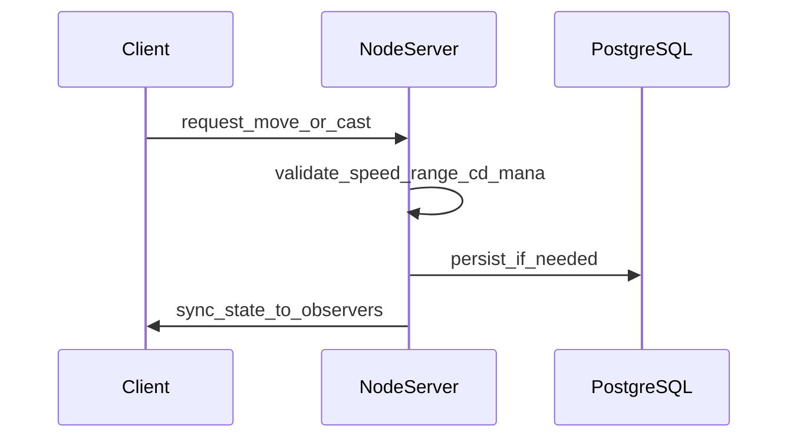

# Feature Slice — Nostale → unser Spiel

Quelle: `Nostale_RPG_Dev_Package.md`. Engine: Unity 6.3 LTS only. Backend: Node.js bleibt Wahrheit.

## Take (MVP)

| Feature | Wie bei uns |
|---------|-------------|
| Server-authoritative | Client sendet nur Inputs, nie Position/HP/Inventar als Wahrheit |
| TCP-ähnlicher Kanal | WebSocket Unity ↔ Node |
| Event-Pipeline | `request_*` → validate → handler → `sync_*` |
| Diskrete Maps | Map-IDs + Ladescreen, keine Seamless-Open-World |
| Lock-on Combat | Skills, Cooldown, Mana, Range — Server prüft |
| Static JSON + DB | items/monsters/skills/maps als JSON; Spieler in PostgreSQL |
| Anti-Cheat basics | Walk-Speed, Range, Cooldown, Mana, Rate-Limit |
| Mini-Slice | 1 Map, 1 Klasse, 3 Skills, 1 Monster-Typ |
| Kleine 2.5D-Overworld | Seitliche Charakter-/Gegneransicht, wenige Maps |
| Gacha + Pity | Bleibt Meta, server-autoritativ |

## Later (Architektur vorbereiten, nicht bauen)

| Feature | Vorbereitung |
|---------|--------------|
| InstanceManager | `/src/maps` so schneiden, dass Map-Kopien möglich sind |
| Party / Instanzen | party_id + instance_id in Events/Schema |
| Interest Management / Sharding | Map-ID als Grenze; ein Prozess reicht jetzt |
| Inventar / Equip / Trade | Inventar-Slots im Schema, UI und Logik später |
| Login- vs World-Server | Jetzt ein Monolith mit `/auth` + `/net` |
| Chat / Friends / Gilden / AH | MMO-longterm, keine MVP-Module |

## Skip

| Feature | Grund |
|---------|-------|
| Godot, GDScript, ENet, Headless | Unity 6.3 LTS only |
| Unity Dedicated Server / NGO als Autorität | Node-Monolith ist Source of Truth |
| Photon als Client-Netz-Ersatz | Eigenes WebSocket zum Node-Backend |
| Auto-Battle-Grid im MVP | Plan B, zurückgestellt |
| Voller MMO-Scope | 50–100 Spieler/Map, Gilden, Auktionshaus |
| 8-Dir-Sprites + Equipment-Layer | Zu teuer für den ersten Slice |
| Client-side Inventory als Wahrheit | Exploit-Risiko (Nostale-Private-Server-Lehre) |
| Custom UDP / Free-Aim-Physik | Unnötig für lock-on 2D |

## Event-Fluss

